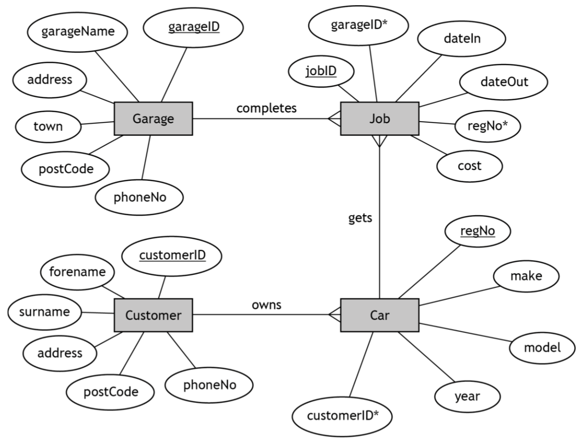

# H CS 2020 Task 1B

### Database design and development

After further analysis, the developer creates the entity-relationship diagram shown below.

The design is then implemented.

___1b(i)___ Customers pay for completed jobs on the day they take their car out of the garage.

The company wants to list the total value of sales (in £s) for each of its five garages on 19 January 2020.

Implement the SQL statement that will produce an output with the headings:

| garageName | Total sales |
| --- | --- |

(__4 marks__)

Print evidence of:

* the implemented SQL statement
* the output it produced

Ensure your name and candidate number is on all evidence.

___1b(ii)___ The company wants to identify the details of the car that spent the most number of days in any of its garages.

Implement two SQL statements that will find the highest number of days, the registration number and the name of the garage where the car was repaired.

| Number of days | regNo | garageName |
| --- | --- | --- |

(__4 marks__)

Print evidence of:

* the implemented SQL statements
* the output produced from each statement

Ensure your name and candidate number is on all evidence.